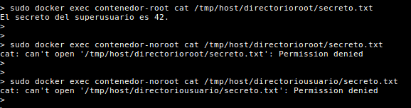

# Introducción
Este repositorio continene los ficheros originales del [artículo del blog 'Contenedor Inseguro'](https://www.contenedorinseguro.net/2019/10/definiendo-usuario-contenedor-docker.html) sobre la importancia de definir el usuario en los contenedores Docker. 


# Instalación
Para copiar el repositorio a local: 

```
git clone https://github.com/daviddetorres/definiendo-usuarios-docker
```

Para ejecutar en local la aplicación se requieren las siguientes librerías: 
* Flask
* waitress

Para la instalación de estos paquetes: 

```
pip3 install Flask waitress
```

Para crear las imágenes deberéis [tener instalado Docker](https://docs.docker.com/install/). 

# Preparando los directorios de pruebas de acceso
Crearemos primer un directorio con acceso al usuario con el que estamos trabajando (que no es root...) y un fichero con un texto dentro.

```
mkdir /tmp/directoriousuario 
echo "El secreto del usuario es que no tiene secretos." > /tmp/directoriousuario/secreto.txt 
chmod 700 /tmp/directoriousuario 
chmod 600 /tmp/directoriousuario/secreto.txt
```

También crearemos un directorio con un usuario root también con un archivo que contenga un secreto.

```
sudo mkdir /tmp/directorioroot
sudo sh -c 'echo "El secreto del superusuario es 42." > /tmp/directorioroot/secreto.txt'
sudo chmod 700 /tmp/directorioroot
sudo chmod 600 /tmp/directorioroot/secreto.txt
```

# Creando las imágenes y los contenedores de Docker
A continuación se muestran los comandos para crear las diferentes imágenes y contenedores con diferentes configuraciones de usuarios.

Imagen con usuario por defecto (root):

```
docker build -f Dockerfile_usuariopordefecto -t app-usuario-root .
docker run -p 5000:5000 -v /tmp:/tmp/host -d --name contenedor-root app-usuario-root
```
Imagen con usuario definido (usuariocontenedor):

```
docker build -f Dockerfile_conusuario -t app-usuario-noroot .
docker run -p 5001:5000 -v /tmp:/tmp/host -d --name contenedor-noroot app-usuario-noroot
```
Imagen con usuario y uid definido (usuariocontenedoruid):

```
docker build -f Dockerfile_conusuariouid -t app-usuario-norootuid .
docker run -p 5002:5000 -v /tmp:/tmp/host -d --name contenedor-norootuid app-usuario-norootuid
```

# Probando los accesos con los diferentes contenedores

Para probar la lectura del fichero /tmp/directorioroot/secreto.txt desde el contenedor con usuario por defecto:

```
docker exec contenedor-root cat /tmp/host/directorioroot/secreto.txt
```

Para probar la lectura del fichero /tmp/directorioroot/secreto.txt desde el contenedor con usuario definido:

```
docker exec contenedor-noroot cat /tmp/host/directorioroot/secreto.txt
```

Para probar la lectura del fichero /tmp/directoriousuario/secreto.txt desde el contenedor con usuario definido:

```
docker exec contenedor-noroot cat /tmp/host/directoriousuario/secreto.txt
```

La ejecución de estos comandos tiene el siguiente resultado:

